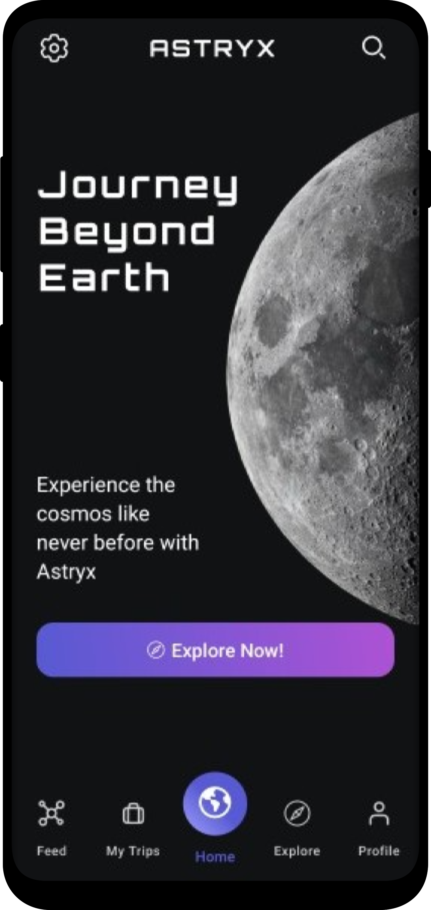
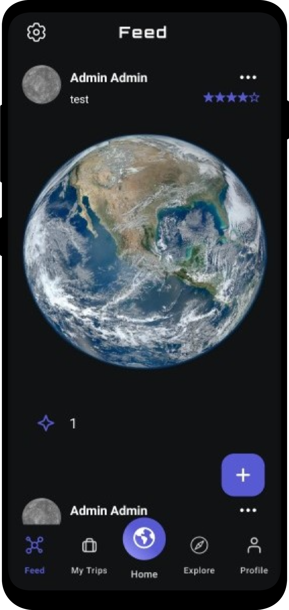
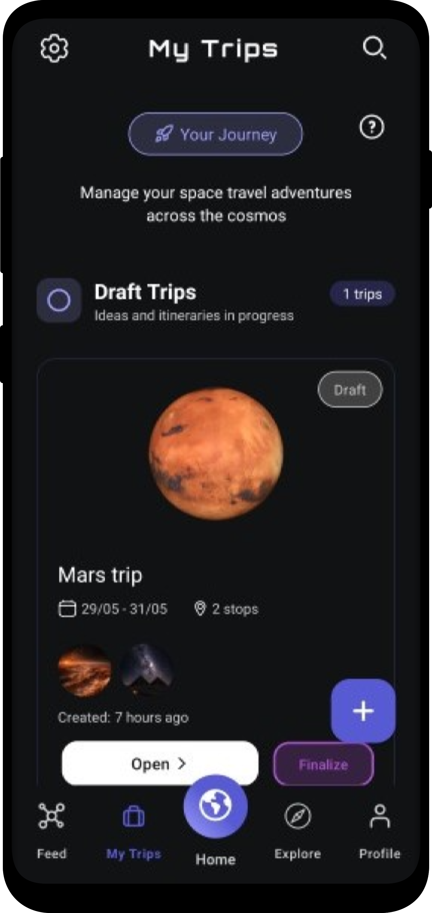
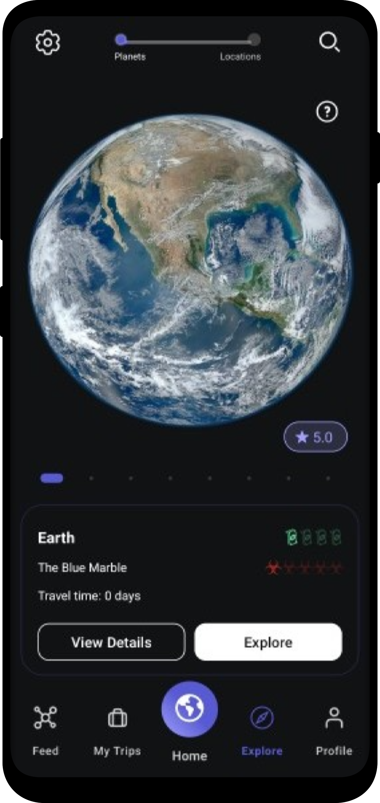
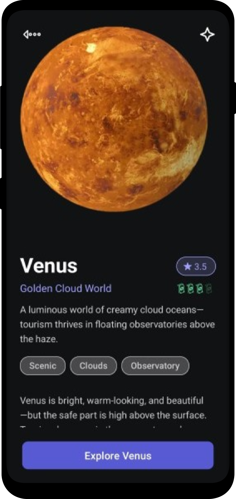
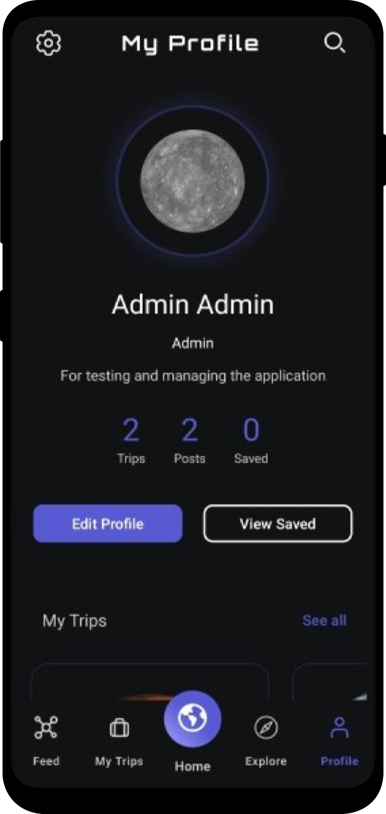
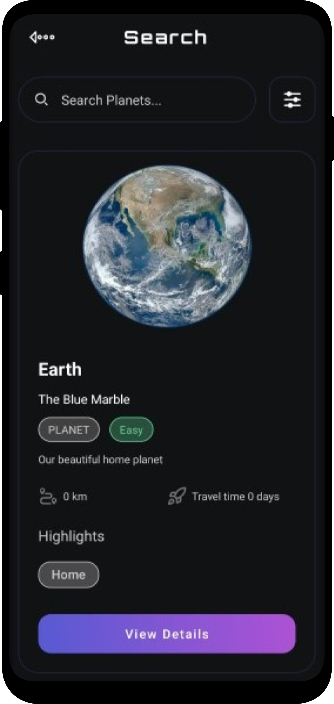
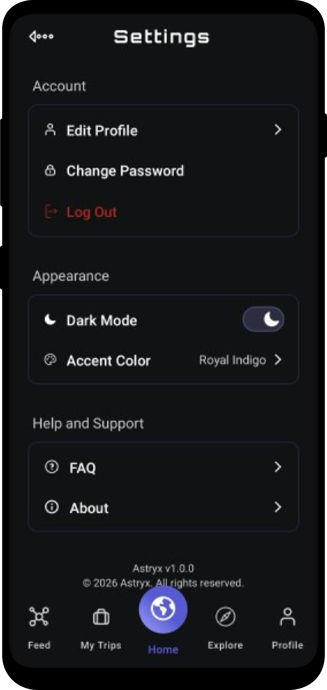

# Astryx - Your Galactic Travel Companion

Astryx is a powerful, real-time travel platform designed for the modern explorer of the cosmos.
It enables users to discover distant planets, plan complex multi-stop space voyages, and share their
experiences with a global community of travelers.
By leveraging modern Android technologies, Astryx turns every star in the sky into a reachable
destination.

## 🌟 Vision

In an era where the stars are no longer the limit, Astryx brings the "Galactic Guide" to your
pocket.
Whether it's planning a vacation to Mars, reading reviews about a remote space station, or sharing
your latest journey, Astryx makes cosmic exploration accessible, organized, and deeply personal.

## 🚀 Core Features

* **Professional Trip Planner:** Build multi-stop voyages by adding destinations to your itinerary.
  Reorder your route with ease and add personal notes for every stop.
* **Interactive Exploration:** Browse the universe through organized categories (Planets, Stations,
  etc.) with smart tags for trending and popular locations.
* **Community Feed:** A social hub where users publish posts about their travels. Explore others'
  adventures and interact through likes.
* **Reviews & Ratings:** A comprehensive system where users leave feedback for destinations they've
  visited, helping the community choose their next star.
* **Smart Search & Filters:** Find your next destination by name or use filters like destination
  type and difficulty level.
* **Deep Personalization:**
    * **Accent Colors:** Choose a primary color theme that applies across the entire app UI.
    * **Day/Night Mode:** Full support for light and dark themes.
    * **Avatar Gallery:** Choose from a wide selection of space avatars or upload your own profile
      photo.
* **Gamification (Badges):** Earn unique achievements and badges for your activities, encouraging
  continuous exploration.
* **Favorites System:** Save your dream destinations to a dedicated list for quick access.
* **Account Security:** Secure login system with integrated password reset functionality via email.

## 📱 Visual Showcase

|                         Home                          |                         Feed                          |                         My Trips                          |                         Explore                          |
|:-----------------------------------------------------:|:-----------------------------------------------------:|:---------------------------------------------------------:|:--------------------------------------------------------:|
|  |  |  |  |

|                         Destination                          |                         Profile                          |                         Search                          |                         Settings                          |
|:------------------------------------------------------------:|:--------------------------------------------------------:|:-------------------------------------------------------:|:---------------------------------------------------------:|
|  |  |  |  |


## 🛠 Technical Excellence

* **Language:** Kotlin.

* **Architecture:** MVVM (Model-View-ViewModel) for clean separation of concerns.
    * `:app` **Module:** A single-module architecture containing the UI layer (Fragments,
      ViewModels), Repository patterns, and Firebase integration.

* **UI/UX:**
    * **ViewBinding:** For safe and efficient layout interaction.
    * **Material Design 3:** For a modern UI with support for dynamic colors and themed components.
    * **Glide & Lottie:** For efficient image loading and high-quality vector animations.

* **Backend & Infrastructure:**
    * **Firebase Firestore:** Real-time NoSQL database for destination data, user profiles, and
      community posts.
    * **Firebase Authentication:** Secure login system supporting Email/Password providers and
      password recovery.
    * **Firebase Storage:** Secure hosting for user-uploaded profile pictures and post images.

## ⚙️ How to Run

### Prerequisites:

* **Android Studio:** Ladybug (2024.2.1) or newer.
* **Android SDK:** 34 or higher.
* **Firebase Account:** Required to set up the backend services.

### 1. Clone & Open:

Clone this repository and open the project folder in Android Studio.

```bash
git clone https://github.com/Igor19c/Astryx.git
```

### 2. Firebase Setup:

To enable all features (Auth, Feed, Profiles), you must connect your own Firebase project:

1. Create a new project in the [Firebase Console](https://console.firebase.google.com/).
2. Add an **Android App** to the project.
3. **Important:** Use the package name: `com.example.astryx` (as defined in the project
   structure).
4. Download the `google-services.json` file and place it in the `app/` directory of the project.
5. In the Firebase Console, enable the following services:
    * **Authentication:** Enable the "Email/Password" provider.
    * **Cloud Firestore:** Create a database (Start in "Test Mode").
    * **Storage:** Create a default bucket for image uploads.

### 3. Build & Run:

1. Click **Sync Project with Gradle Files** in Android Studio.
2. Connect a physical device or start an Emulator (API 30+ recommended).
3. Click the **Run** button to build and launch **Astryx**.
